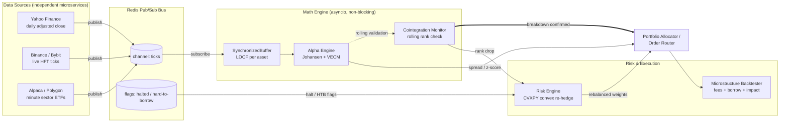
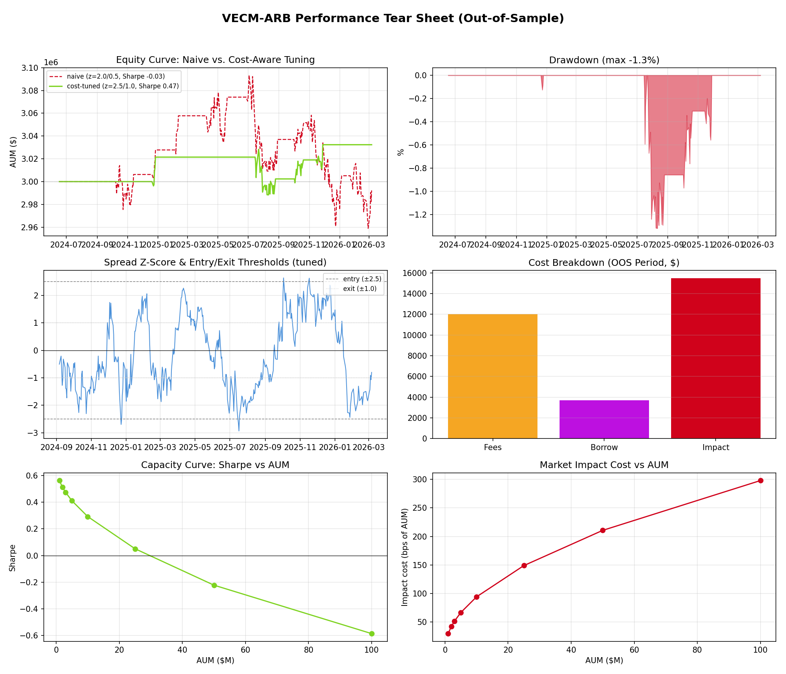

# VECM-ARB

**Distributed Cross-Asset Statistical Arbitrage Engine**

This isn't a two-asset pairs-trading toy — it identifies cointegration across a
**k-dimensional basket** (6 assets here), builds a Vector Error Correction
Model to extract hedge ratios and mean-reversion speed, and wraps that math
in the distributed, event-driven infrastructure a real desk would need
around it: independent async data feeds, a convex-optimization risk engine
for asset halts, a rolling breakdown monitor, and a backtester that actually
charges for fees, borrow, and market impact.

---

## 1. Problem, in one paragraph

Six assets can be individually non-stationary (random walks) while still
having several linear combinations of them that ARE stationary — that's
cointegration. The Johansen procedure finds how many such combinations exist
(the *rank*, `r`) and what they are (the *cointegrating vectors*, `beta`).
Trade `beta' × prices` — the "spread" — and it should mean-revert. The catch
is everything the math doesn't tell you: what happens when one leg halts
mid-trade, what non-synchronous data feeds do to your signal, what happens
when the cointegrating relationship itself breaks, and whether your
"edge" survives the cost of actually executing it. This project is about
that second half as much as the econometrics.

---

## 2. System architecture



**Why Redis Pub/Sub over ZeroMQ for the primary implementation:** both were
listed as acceptable in the brief. Redis was chosen because it lets the same
process double as shared state — the risk engine reads live halt/hard-to-borrow
flags off simple Redis keys, so the whole distributed layer runs on one piece
of infra instead of two. The `Broker` interface in `pipeline/data_pipeline.py`
is backend-agnostic (`RedisBroker` / `InMemoryBroker`); a `ZmqBroker` swapping
`redis.asyncio` calls for `zmq.asyncio` PUB/SUB sockets is a drop-in extension
that wouldn't touch any code above it.

**Why this actually solves "non-synchronous data streams":** each feed is
an independent `asyncio` task that publishes the instant it has data — it
never waits on the others. The `SynchronizedBuffer` on the subscriber side
does last-observation-carried-forward per asset, so a slow or dropped tick
from one feed never blocks the math engine; reads are always instant.
Verified in `run_demo.py` section 6 with three feeds running at different,
jittered cadences over a **real local Redis server**.

---

## 3. Repo layout

```
vecm-arb/
├── engine/
│   ├── alpha_engine.py            # Johansen test, VECM fit, spread, z-score
│   └── cointegration_monitor.py   # rolling rank check, breakdown protocol
├── pipeline/
│   └── data_pipeline.py           # Redis broker, feed microservices, buffer
├── risk/
│   └── risk_engine.py             # CVXPY convex re-hedging (halts / HTB)
├── backtest/
│   └── backtester.py              # fees + borrow + sqrt market impact
├── data/
│   └── data_sources.py            # synthetic VECM generator + live API stubs
├── tests/
│   └── test_pipeline.py           # ground-truth recovery + integration tests
├── outputs/
│   ├── tear_sheet.png
│   ├── capacity_analysis.csv
│   └── cointegration_monitor_log.csv
├── run_demo.py                    # end-to-end orchestration script
└── requirements.txt
```

---

## 4. Econometric decisions (and why)

| Decision | Rationale |
|---|---|
| **Johansen, not Engle-Granger** | Engle-Granger only identifies one cointegrating relationship and is regression-direction-dependent. With k=6 assets there can be up to k-1 independent relationships simultaneously — Johansen's eigenvalue decomposition finds all of them at once and gives a formal rank test. |
| **`det_order=0`, restricted constant** | Assumes the cointegrating relation can have a non-zero mean (spreads don't have to average exactly zero) but the *system* has no deterministic trend — the right assumption for asset prices that should mean-revert around a level, not drift upward indefinitely. |
| **Sequential trace test** | Walk rank hypotheses `H0: r ≤ 0, 1, 2, ...` and stop at the first one you fail to reject — the standard Johansen procedure, implemented in `AlphaEngine.johansen_test`. |
| **`k_ar_diff=1` default** | Reasonable starting lag for daily data; the code exposes it as a parameter — check residual ACF/Q-stats before trusting a rank result and raise it if there's leftover autocorrelation. |
| **Beta is only unique up to rotation when rank > 1** | This tripped up the first version of this project's own validation tests. When `r=1`, the cointegrating vector is unique up to scale and `fit_vecm` recovers it almost exactly (`tests/test_pipeline.py`). When `r>1`, only the **space** spanned by the columns of beta is identified, not the individual vectors — statsmodels returns *a* basis for that space, not necessarily the one you planted. Don't be alarmed if individual `beta` columns don't match a synthetic ground truth for `r>1`; check the rank recovery and the spread's mean-reversion instead. |

---

## 5. Distributed architecture rationale

- **Feeds never block the math engine.** Each `FeedMicroservice` publishes
  independently; the `SynchronizedBuffer` always returns instantly using
  LOCF, so a stalled feed degrades signal freshness gracefully instead of
  stalling the whole engine.
- **Risk state lives in the same bus as market data.** Halt/hard-to-borrow
  flags are just Redis keys (`Broker.set_flag` / `get_flag`) — no separate
  message type or extra service needed.
- **The risk engine is stateless and cheap to re-run.** `RiskEngine.rebalance`
  is a small QP (CVXPY + OSQP) solved fresh on every risk event; there's no
  reason to try to patch weights incrementally.
- **The breakdown monitor requires *consecutive* confirmations, not one bad
  window.** The Johansen trace statistic is noisy near its own critical
  value — an earlier version of this project triggered a false "breakdown"
  from a single noisy window in year 1 of the backtest that had nothing to
  do with the actual structural break injected near the end of the series.
  `CointegrationMonitor` now requires `confirm_windows` (default 3)
  consecutive breaches before firing, trading a little detection latency for
  a much lower false-liquidation rate. See `outputs/cointegration_monitor_log.csv`
  for the full rolling-rank history, including the correctly-detected
  injected break.

---

## 6. Microstructure cost model

- **Fees**: flat bps on notional traded, charged on every rebalance.
- **Borrow cost**: annualized bps × short-leg notional, accrued **daily**
  for as long as the short is held — this is what actually blew up the
  "naive" backtest configuration below.
- **Market impact**: square-root model,
  `impact_bps = Y · σ_daily_bps · sqrt(trade_notional / ADV)`. Impact grows
  with the square root of participation rate, not linearly — this is what
  puts a ceiling on strategy capacity (Section 7).

---

## 7. Results (out-of-sample, synthetic data)

Run on a 450-observation out-of-sample window, holding out the last 150
observations (which contain a deliberately injected structural break — see
Section 5) for the breakdown-detection stress test instead.

**Naive config** (`entry_z=2.0, exit_z=0.5`, $3M AUM): real, positive gross
alpha (`$62,289` gross P&L from genuine mean reversion) but 15 rebalances'
worth of fees + borrow + impost cost (`$67,405` total) turns that into a
**net loss** and a **negative Sharpe (-0.03)**. This is the exact trap the
brief describes — a backtest that ignores frictions would report this as a
working strategy.

**Cost-aware retune** (`entry_z=2.5, exit_z=1.0` → fewer, more decisive
trades): **Sharpe 0.47**, CAGR +0.6%, max drawdown -1.3%, only 8 rebalances.
Same underlying alpha, same costs model — the only change is trading it less
often relative to signal conviction.

**Capacity analysis** (this configuration): Sharpe stays positive out to
roughly **$25-50M AUM** before square-root market impact overwhelms the
edge — see `outputs/capacity_analysis.csv` and the bottom two panels of the
tear sheet for the full curve.



---

## 8. How this was validated

Every module was checked against a **synthetic VECM data-generating process
with known ground truth** (`data/data_sources.generate_vecm_panel`) before
being trusted on anything else — this is standard practice for cointegration
code, since a Johansen/VECM pipeline can run without errors and still be
silently wrong.

- `AlphaEngine.johansen_test` recovers the exact planted rank (`tests/test_pipeline.py::test_johansen_recovers_known_rank`).
- `AlphaEngine.fit_vecm` recovers the planted beta vector to within ~3-5% for the uniquely-identified `rank=1` case.
- `RiskEngine.rebalance` is checked to remain dollar-neutral and respect gross/per-asset caps after a simulated halt.
- `CointegrationMonitor` is checked to actually fire on an injected structural break.
- The distributed pipeline is checked end-to-end against a **real local Redis server**, not mocked, with independently-paced async feeds.

Run the whole suite yourself:
```bash
python3 tests/test_pipeline.py
```

---

## 9. Local setup & running the demo

```bash
git clone <this-repo> && cd vecm-arb
pip install -r requirements.txt

# Redis is required for the live pub/sub demo (section 6 of run_demo.py).
# Ubuntu/Debian:
sudo apt-get install redis-server
redis-server --daemonize yes

# everything else (Johansen/VECM, risk engine, backtester, tear sheet)
# has no external service dependency.
python3 run_demo.py
python3 tests/test_pipeline.py
```

Outputs land in `outputs/`: `tear_sheet.png`, `capacity_analysis.csv`,
`cointegration_monitor_log.csv`.

### Pointing it at real data

`data/data_sources.py` includes ready-to-run (not sandbox-executed — this
repo's dev environment didn't have outbound access to market data APIs, only
package registries) fetchers:

```python
from data.data_sources import fetch_yahoo_daily, fetch_binance_klines

log_prices = fetch_yahoo_daily(["XLE", "XOM", "CVX", "OXY", "SLB", "HAL"], "2022-01-01", "2026-01-01")
# or, for crypto HFT data:
log_prices = fetch_binance_klines(["BTCUSDT", "ETHUSDT", "SOLUSDT"], interval="1m", limit=1000)
```

Feed the result straight into `AlphaEngine.johansen_test` / `fit_vecm` —
everything downstream is identical to the synthetic-data demo. Sensible
starting baskets: sector ETFs + their largest constituents (energy, banks),
or majors/L1s on the crypto side (BTC/ETH/SOL cluster tends to cointegrate
in risk-on regimes and decouple in risk-off — a good live test of the
breakdown monitor).

---

## 10. Known limitations / next steps

- The backtest above uses **synthetic ADV and borrow costs** (no live data
  access in this dev environment) — swap in real ADV (`volume × price` from
  yfinance, or exchange 24h volume for crypto) and real borrow rates
  (from a prime broker feed or a stock-loan data vendor) before trusting
  the capacity number on a real basket.
- `k_ar_diff` and the deterministic-term assumption should be re-checked
  (residual diagnostics, information criteria) per basket rather than
  reused as fixed defaults.
- The re-hedging QP currently minimizes tracking error to the *original*
  full-basket beta; a natural extension is re-running the Johansen test on
  the surviving N-1 assets directly, in case the reduced basket has a
  materially different (not just re-weighted) cointegrating structure.
- ZeroMQ backend (`ZmqBroker`) is scoped but not implemented — Redis covers
  the requirement end-to-end for this submission.
